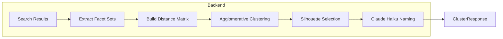

# Facet Space Clustering Implementation

Add a new "Clustered" view alongside the existing ripper that groups search results by facet profile similarity, automatically determines optimal cluster count (2-6) using silhouette score, and generates pithy cluster names via Claude Haiku.

## Algorithm Design

### 1. Similarity Function (Jaccard on Facet Sets)

Convert each item's facets to a set of `"facetName:facetValue"` strings, then use Jaccard similarity:

```
similarity(A, B) = |A ∩ B| / |A ∪ B|
```

**Why Jaccard:**

- Natural for set-based categorical data
- Handles variable facet counts per item
- Range [0,1] is intuitive
- Fast to compute for 100 items (4,950 pairs)

**Handling multi-valued facets:** An item with `tags: ["red", "blue"]` produces two set members: `tags:red` and `tags:blue`.

### 2. Clustering Algorithm (Agglomerative with Silhouette Selection)

Use **agglomerative hierarchical clustering** with average linkage:

- Works directly with Jaccard distance matrix
- No need for numeric embeddings
- Can evaluate multiple cluster counts efficiently from one dendrogram

**Cluster count selection:**

- Cut dendrogram at k = 2, 3, 4, 5, 6
- Compute silhouette score for each k
- Select k with highest silhouette score
- Items that are poor fits (silhouette < 0) go to "Other" cluster

### 3. Cluster Labeling (Claude Haiku)

For each cluster, extract:

- Top 5 most common facet:value pairs (by count within cluster)
- Cluster size
- Representative item names (optional)

Prompt Claude Haiku:

```
Given these facet characteristics of a product cluster:
- Most common: brand:Apple (80%), category:Phone (75%), color:Black (40%)
- 12 items total

Generate a pithy 1-3 word label for this cluster.
Respond with ONLY the label, nothing else.
```

## Data Flow



## Implementation

### Backend Changes

**New file: `backend/internal/ize/cluster.go`**

- `ClusterProcessor` struct
- `extractFacetSets(hits []Hit) []map[string]bool` - convert hits to facet sets
- `buildDistanceMatrix(sets []map[string]bool) [][]float64` - Jaccard distances
- `agglomerativeCluster(distMatrix, k int) []int` - cluster assignments
- `selectOptimalK(distMatrix [][]float64) (int, []int)` - silhouette-based selection
- `buildClusterStats(hits, assignments) []ClusterStats` - facet counts per cluster

**New file: `backend/internal/anthropic/client.go`**

- `Client` struct with API key config
- `GenerateClusterName(stats ClusterStats) (string, error)` - call Haiku

**Modify: `backend/internal/httpapi/dto.go`**

```go
type ClusterGroup struct {
    Name       string         `json:"name"`      // LLM-generated label
    Items      []SearchResult `json:"items"`
    TopFacets  []FacetCount   `json:"topFacets"` // For transparency
}

type ClusterResponse struct {
    Groups     []ClusterGroup `json:"groups"`
    OtherGroup []SearchResult `json:"otherGroup"`
    ClusterCount int          `json:"clusterCount"` // Selected k
}
```

**Modify: `backend/internal/httpapi/handler.go`**

- Add `HandleCluster` method
- New endpoint `/api/cluster`

**Modify: `backend/internal/config/config.go`**

- Add `AnthropicAPIKey` field

### Frontend Changes

**New file: `frontend/src/components/ClusterView.vue`**

- Display clusters with LLM-generated names
- Show top facets for transparency
- Expandable item lists per cluster

**Modify: `frontend/src/components/FacetedSearch.vue`**

- Add "Clustered" tab alongside existing "RIPPER" tab

**Modify: `frontend/src/api/search.ts`**

- Add `searchCluster(query: string): Promise<ClusterResponse>`

**Modify: `frontend/src/types.ts`**

- Add `ClusterGroup`, `ClusterResponse` types

## Key Design Decisions

| Decision             | Choice                          | Rationale                                          |
| -------------------- | ------------------------------- | -------------------------------------------------- |
| Similarity metric    | Jaccard                         | Natural for categorical sets, no tuning needed     |
| Clustering algorithm | Agglomerative (average linkage) | Works with any distance, single pass for all k     |
| Cluster count        | Silhouette-based auto-selection | Objective measure, avoids user configuration       |
| "Other" handling     | Items with negative silhouette  | Poor-fit items don't distort cluster labels        |
| LLM                  | Claude Haiku                    | Fast, cheap ($0.25/1M tokens), good at short tasks |
| LLM caching          | None initially                  | ~5 calls per search, Haiku is fast enough          |

## Edge Cases

- **No facets on items:** All items go to "Other", return single cluster or error
- **All items identical facets:** Returns k=1 cluster (silhouette undefined for k=1, use heuristic)
- **LLM failure:** Fall back to "Cluster 1", "Cluster 2" naming
- **Very small result sets (<6 items):** Cap k at item count - 1

## Testing

- Unit tests for Jaccard calculation
- Unit tests for distance matrix construction
- Unit tests for silhouette score calculation
- Integration test with mock Anthropic client
- Edge case tests (empty facets, identical items, single item)

## Future Consideration: Graph-Based Community Detection

An alternative approach worth exploring is **graph-based community detection** (e.g., Louvain, Label Propagation), where items are nodes and edges represent facet similarity. This could discover non-spherical, naturally-forming communities rather than forcing spherical clusters.

However, graph-based approaches would be most valuable if implemented **at the search/indexing layer** rather than as a post-query algorithm:

- **Pre-computed item similarity graph** stored alongside the search index
- **Community memberships** indexed as facets themselves
- **Query-time filtering** by community rather than post-hoc clustering

This would shift the computational cost to indexing time and enable instant community-based filtering at query time. Worth considering if facet clustering proves valuable and we want to scale it or integrate it more deeply into the search experience.
